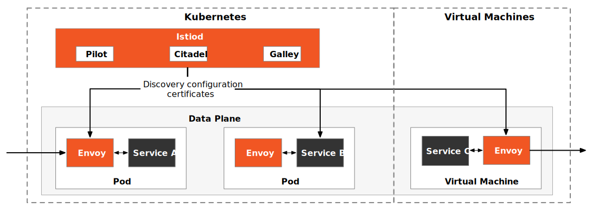
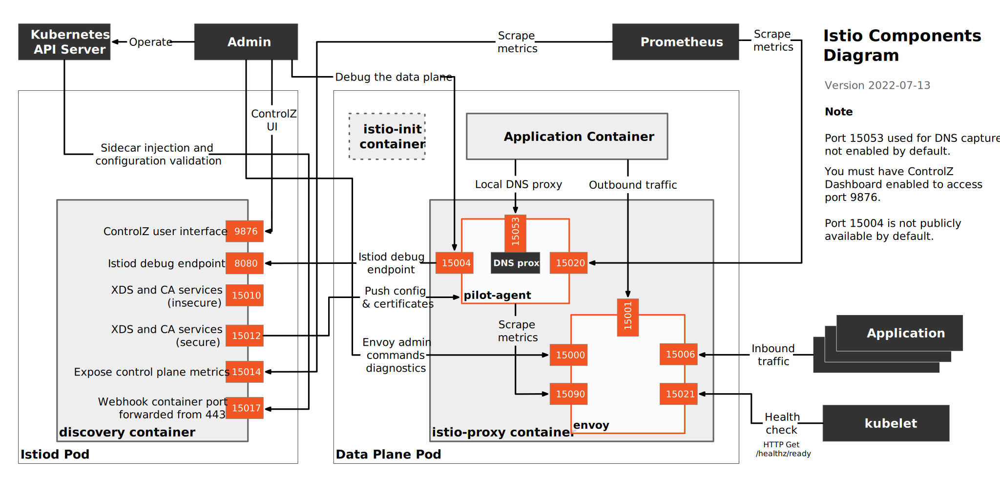
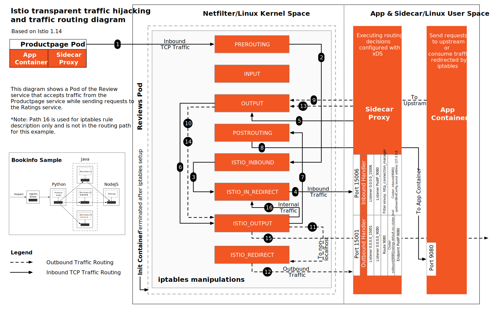
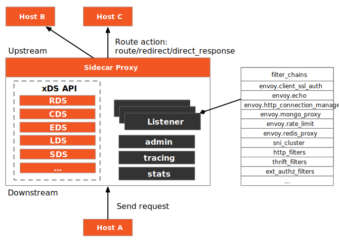
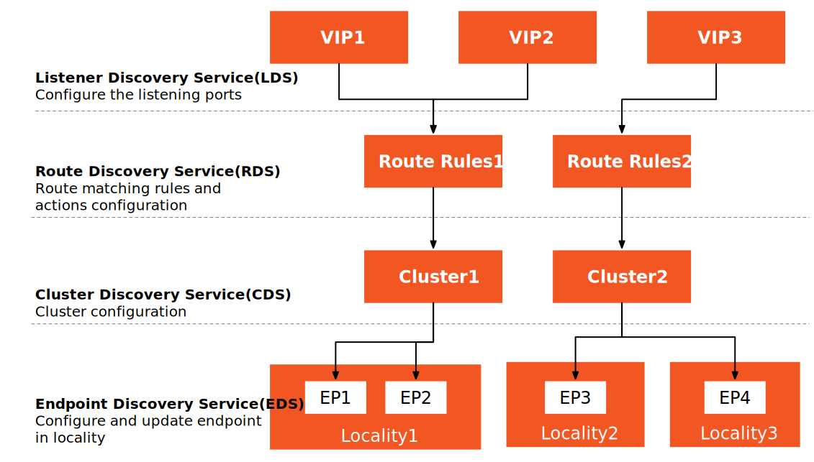

## Intro

## Architecture

### Istio Architecture

Istio control plane is a single process -  `istiod`, which contains three components Pilot, Citadel and Galley. You can bring containers in Kubernetes and virtual machines into the Istio mesh together.

{:data-img="img/istio-arch.svg"}

### Components

The following figure show the components in Istio mesh.

{:data-img="img/istio-components.svg"}

### Transparent Traffic Hijacking

The following figure shows the transparent traffic hijacking and traffic routing in Istio. 

{:data-img="img/transparent-traffic-hijacking.svg"}

**Note**

- Only TCP traffic is shown in the figure. Traffic for UDP and other protocols will not be hijacked.
- It is based on Istio 1.14.
- It shows the traffic routing in `reviews` pod of the [Bookinfo](https://istio.io/latest/docs/examples/bookinfo/) sample.

### Data Plane

[Envoy](https://envoyproxy.io) is the default sidecar proxy in Istio.

{:data-img="img/envoy-arch.svg"}

See [Envoy section](#envoy).

## Envoy

### xDS

Istiod distributes the proxy configurations to Envoy via [xDS](https://www.envoyproxy.io/docs/envoy/latest/api-docs/xds_protocol) protocol.

{:data-img="img/xds.svg"}

