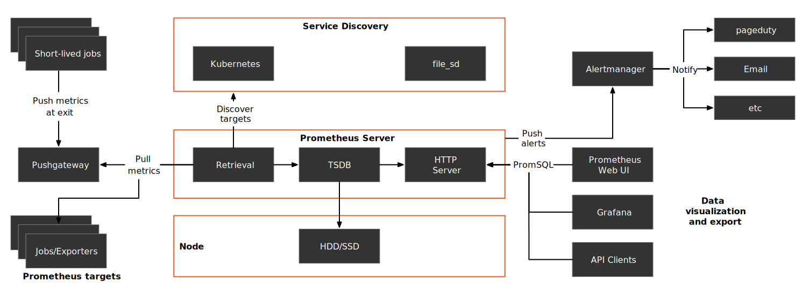

## Intro

## Metrics

### Prometheus

The following figure shows the architecture of Prometheus.

{:data-img="img/prometheus-arch.svg"}

#### [Data model](https://prometheus.io/docs/concepts/data_model/)

```
<metric name>{<label name>=<label value>, ...} value
```

Example

```
api_http_requests_total{method="POST", handler="/messages"} 300
```

#### [Metric types](https://prometheus.io/docs/concepts/metric_types/)

| Types    | Description  | Example |
| -------- | -------------- | ------- |
| Counters | A *counter* is a cumulative metric that represents a single monotonically increasing counter whose value can only increase or be reset to zero on restart. | Total requests |
| Gauges | A *gauge* is a metric that represents a single numerical value that can arbitrarily go up and down. | Current active requests |
| Histograms | A *histogram* samples observations (usually things like request durations or response sizes) and counts them in configurable buckets. It also provides a sum of all observed values. | Upstream request time |
{:.-headers}

#### Targets

- kuberentes-apiservers
- kubernetes-nodes
- kubernetes-nodes-cadvisor
- kubernetes-pods
- kubernetes-service-endpoints
- prometheus

### Istio Standard Metrics

| Protocol        | Name                                  | Type      |
| --------------- | ------------------------------------- | --------- |
| HTTP/HTTP2/gRPC | `istio_requests_total`                | counter   |
| HTTP/HTTP2/gRPC | `istio_request_duration_milliseconds` | histogram |
| HTTP/HTTP2/gRPC | `istio_request_bytes`                 | histogram |
| HTTP/HTTP2/gRPC | `istio_response_bytes`                | histogram |
| HTTP/HTTP2/gRPC | `istio_request_messages_total`        | counter   |
| HTTP/HTTP2/gRPC | `istio_response_messages_total`       | counter   |
| TCP             | `istio_tcp_sent_bytes_total`          | counter   |
| TCP             | `istio_tcp_received_bytes_total`      | counter   |
| TCP             | `istio_tcp_connections_opened_total`  | counter   |
| TCP             | `istio_tcp_connections_closed_total`  | counter   |
{:.-headers}

Visit [istio.io](https://istio.io/latest/docs/reference/config/metrics/) for details.


